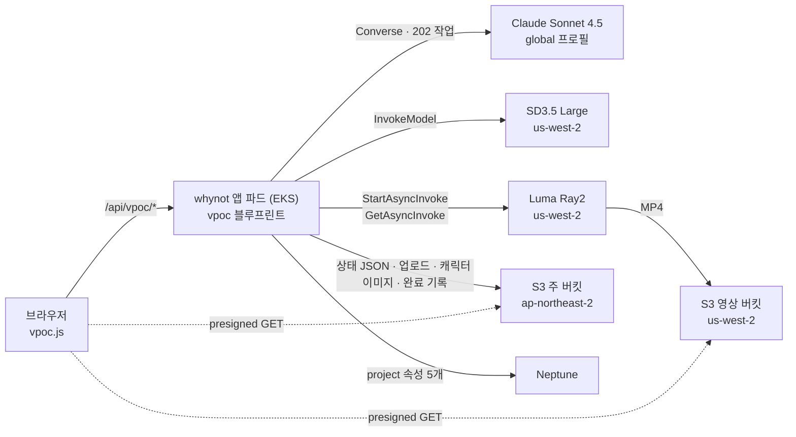

# 와이낫 영상 기능 재구축 — 1단계 POC PRD (vpoc1 · Luma Ray2)

> 작성 2026-09-23 · 저장소 `awstech/ai` · 디렉터리 `AI-POC-whynot`
> AWS 계정 `730335451955`(워크스테이션 CLI 는 `--profile ai-poc-hub`) · 앱 `ap-northeast-2` · 이미지·영상 모델 `us-west-2`
> dev `https://dev-whynot.meta-clouds.com/` · 네임스페이스 `whynot` · 배포 경로는 main 병합 → GitLab CI → ArgoCD `whynot-dev` 하나뿐
>
> **목표는 하나다. dev 에서 AI가 만든 영상을 브라우저로 재생한다.**
> 캐릭터 일관성은 1단계 목표가 아니다(2단계 · Seedance 2.0). 대신 2단계가 그대로 이어받도록 데이터 구조를 만든다.
> 이 문서가 1단계의 유일한 정본이다. 실행 순서는 `steps.md` 가 정한다.

---

## 1. 사전 승인 — 이 PRD로 작업을 시작하면 아래를 승인한 것으로 본다

| ID | 결정 | 값 | 근거·비고 |
|---|---|---|---|
| **D-L01** | 1단계 비용 상한 | **없음 — 누적 표시만 (2026-09-23 사용자 결정)** | 지원 금액이 8,000 USD 라서 60 USD 상한을 없앴다. 원장은 계속 기록하고(항목·키 중복 방지 그대로) 제출을 막지 않는다. 화면은 "누적 비용 {spentUsd} USD" 만 보인다. 금액 불일치(`CostMismatch`) 검사는 유지한다. Luma 540p·5초 = 3.75 USD/샷 |
| **D-L02** | 인프라 변경 허용 범위 | (a) us-west-2 영상 출력 버킷이 **없을 때만** 1개 생성 (b) 앱 IRSA 역할에 권한이 **없을 때만** 부록 B의 빠진 문장을 인라인 정책 `vpoc1-luma` 로 추가 | AWS CLI로 적용하고 `docs/vpoc1/infra-changes.md` 에 명령·시각·결과를 남긴다. Terraform 편입은 prod 배포 뒤 |
| **D-L03** | 구 영상 기능 제거 | 백업 태그 `backup/whynot-video-v4-20260923` 을 원격에 올린 뒤 작업 트리에서 삭제 | **지우지 않는 것: S3·Neptune 데이터, `docs/vendor/`, 다른 고객 파일** |
| D-L04 | Kiro spec 파생 생략 | 이 PRD가 spec이다 | |
| D-L05 | 모델 고정, 조용한 대체 금지 | 5.0 표의 모델 ID만 쓴다 | 실패하면 다른 모델로 내려가지 않고 원문을 보여 준다 |
| D-L06 | dev 오류 원문 노출 | `VPOC_RAW_ERRORS=true` (dev만) | 운영 전환 때 false |
| D-L07 | ECS 미사용 | — | Luma는 비동기 API라 작업자 없이 조회 방식으로 충분하다 |
| D-L08 | 새 코드에 넣지 않는 경로 | Nova Reel · Seedance · GPU(Wan) | Nova Reel은 LEGACY, EOL 2026-09-30 |
| D-L09 | 기본 화풍 | 실사(live-action). 애니 선택 가능 | |
| D-L10 | 영상 규격 | 샷 기본 4개(3~6) × 5초 · 540p · 16:9 · 무음 | 720p·9초는 비용이 2배라 1단계 제외 |
| D-L11 | 크레딧 차감 | 기존 크레딧 로직을 부르지 않는다 | 비용 통제는 vpoc 원장(6.6)이 한다 |
| D-L12 | 공유 프로젝트 권한 | 팀원은 보기만. 입력·생성·되돌리기는 소유자만 | |
| D-L13 | 계획 1개 = 장소 1곳 | 한 영상 안에서 배경을 바꾸지 않는다 | 배경 일관성을 위한 1단계 장치 |

---

## 2. 네 번의 실패에서 가져온 규칙

| 확인된 사실 | 이번에 막는 규칙 |
|---|---|
| 6단계·검사 코드 12종·CI 검사기 13종이 모두 통과했지만 **실제 영상 생성은 0건**이었다 | R1 · R3 |
| 제출 경로가 프롬프트를 `[:512]` 로 **조용히 잘랐다** | R4 |
| 이미지 모델이 **조용히 내려갔고**(style-guide → sd3.5-large) 비용표는 다른 모델 단가를 썼다 | R4 · D-L05 |
| 화면의 **틀린 비용 추정**이 스모크를 보류시켜 작업을 멈춰 세웠다 | R5 |
| 개체 115개 병합·분리·재연결이 영상보다 먼저 커졌다 | R2 |
| 삭제 지시 뒤에도 에이전트가 이전 spec·steering·세션 기억을 끌고 들어왔다 | R6 · 9.3 |

| 규칙 | 내용 |
|---|---|
| R1 영상부터 거꾸로 | 첫 산출물은 브라우저에서 재생되는 실제 클립이다(Gate 1) |
| R2 단계는 4개 | 입력 → 확인 → 계획 승인 → 영상. 개체 정리·캐스트·점수·검토 해소 단계는 없다 |
| R3 완료 증거는 재생뿐 | 정적 검사·mock·픽스처 통과는 완료 증거가 아니다. 새 CI 검사는 `check_vpoc.py` 하나 |
| R4 조용히 자르거나 바꾸지 않는다 | 길이는 생성 단계의 필드 예산으로 보장하고 제출 단계에서 자르지 않는다. 자동 대체는 10장의 두 가지뿐 |
| R5 비용은 서버가 센다 | 차단 근거는 원장(실제 제출 건수)뿐이다. 화면 금액은 서버 계산값을 그대로 보인다 |
| R6 과거 구현을 참조하지 않는다 | 백업 태그 checkout·diff 금지. 이름이 같아도 옛 함수를 재사용하지 않는다 |
| R7 20분 타임박스 | 한 문제에 20분이 넘으면 10장 사전 결정대로 처리하고 진행한다 |
| R8 항상 보이게 | 모든 요청에 진행 표시와 경과 시간, 모든 실패에 원문 |

---

## 3. 범위

| 등급 | 항목 |
|---|---|
| **P0** | 4단계 흐름 · 되돌리기 · 새로고침 복원 / 입력 3방식(한 줄 상황 · 캐릭터 정보+대본 · 웹툰·캐릭터 이미지)을 한 폼에서 / Claude 분석: 빈 곳 채우기 + 질문 최대 3개(기본값 포함) + 캐릭터 시트 / 캐릭터 이미지: 이미지가 없으면 SD3.5로 디자인, 있으면 그 이미지를 쓰고 시트만 보강 / 샷 계획(기본 4) · 샷 삭제 · 영어 프롬프트 직접 수정(고급) / Luma 텍스트→영상 제출·조회·샷 순차 재생 / 진행 표시 · 오류 원문 / 프로젝트 보기(영상 → 캐릭터 → 입력 원문·파일) / 비용 원장·상한 / 구 기능 제거 · CI 교체 · 에이전트 문맥 정리 |
| P1 | 1인 샷에 AI 캐릭터 이미지를 시작 프레임(frame0)으로 · 합본 MP4 · 캐릭터 다시 그리기 · 메인 목록 영상 상태 배지 |
| P2 | 샷 마지막 프레임 저장 · 사용자 이미지 보강본(image-to-image) · 다음 화 만들기 |
| **금지** | Seedance · Nova Reel · GPU · ECS · 3D 모델링 · 개체 정리 · 점수 · 음성/음악 · 720p/9초 · Terraform 실행 · D-L02 밖 인프라 · prod 배포 |

---

## 4. 사용자 흐름

### 4.1 네 단계

| 단계 | 화면에 보이는 것 | 사용자 | 서버 | 유료 호출 | 보통 소요 |
|---|---|---|---|---|---|
| ① 입력 | 글 입력칸 1개 · 캐릭터 카드(선택: 이름·설명·이미지) · 장면/웹툰 이미지(선택) | 입력 → [AI 분석] | 저장 → 분석 작업 시작 | Claude 1회 | 20~60초 |
| ② 확인 | 제목·줄거리·배경(수정 가능) · 화풍(실사/애니) · 캐릭터 시트(탭: 외형·체형·성격·특징·취향, AI가 채운 칸 표시) · 질문 ≤3(기본값 선택됨) · 추가 요청 | 고치기·답하기 → [캐릭터·장면 만들기] | 캐릭터 이미지와 샷 계획을 동시에 | SD3.5 × 이미지 없는 캐릭터 수 + Claude 1회 | 30~90초 |
| ③ 계획 승인 | 캐릭터 카드(이미지·시트) · 샷 목록(쉬운 말 설명·카메라·등장인물·5초) · 서버가 계산한 비용 | 샷 삭제·고급 편집 → [승인하고 영상 만들기] | Luma 제출 | Luma × 샷 수 | 샷당 2~5분 |
| ④ 영상 | 샷별 상태(대기 / 생성 중 mm:ss / 완료 / 실패 + 원문) · 순차 재생 플레이어 · (P1) 합본 | 시청 · [이 샷 다시] · 되돌아가기 | 조회 때 상태 갱신, 모두 끝나면 프로젝트에 저장 | 없음(조회 무료) | — |

### 4.2 입력 방식별 처리

| 입력 | 분석 | 캐릭터 이미지 | 영상 |
|---|---|---|---|
| 한 줄 상황만 | 글에서 인물·배경을 만들고 빈 곳을 채운다 | AI가 디자인(SD3.5) | 텍스트→영상 |
| 캐릭터 정보 + 대본/지문 | 사용자가 쓴 이름·외형·관계를 그대로 두고 빈 곳만 채운다 | 이미지가 없으면 AI 디자인 | 텍스트→영상 |
| 캐릭터 이미지 포함 | 이미지에서 외형을 읽어 시트를 보강한다(글과 충돌하면 글이 우선) | **사용자 이미지를 그대로 쓴다** | 텍스트→영상(사용자 이미지는 키프레임에 쓰지 않는다) |
| 웹툰 컷 이미지 | 컷에서 인물·배경·사건을 읽는다(세로로 긴 이미지는 타일로 잘라서) | 읽은 외형으로 선택한 화풍에 맞춰 AI가 디자인 | 텍스트→영상(웹툰 컷은 키프레임에 쓰지 않는다 — 5.1 필터) |

### 4.3 되돌리기

| 동작 | 결과 |
|---|---|
| 단계 표시줄에서 지난 단계를 누른다 | 그 단계로 이동만 한다. 데이터는 그대로다 |
| 지난 단계를 고쳐 다시 실행한다 | 뒤 단계는 '다시 만들어야 함'(stale)이 된다. 실행 전에 버려질 것을 확인 창에 보여 준다 |
| AI 작업(분석·준비) 중에 되돌아간다 | 그 작업의 결과를 버린다(취소와 같다) |
| 영상 생성 중에 되돌아간다 | 추적만 멈춘다. Bedrock 비동기 API는 시작·조회·목록뿐이라 생성은 끝까지 가고 비용이 나간다. 확인 창에 그대로 적는다 |
| 새로고침·재로그인 | 서버에 저장된 단계와 결과가 그대로 복원된다 |

---

## 5. 모델별 주의사항

### 5.0 쓰는 모델

| 용도 | 모델 ID | 리전 | 호출 |
|---|---|---|---|
| 분석·계획(텍스트+비전) | `global.anthropic.claude-sonnet-4-5-20250929-v1:0` | ap-northeast-2(글로벌 추론 프로필) | Converse |
| 캐릭터 이미지 | `stability.sd3-5-large-v1:0` | us-west-2 | InvokeModel |
| 영상 | `luma.ray-v2:0` | us-west-2 | StartAsyncInvoke / GetAsyncInvoke |

### 5.1 Luma Ray2

| 항목 | 사실 | 1단계 대응 |
|---|---|---|
| 호출 | 비동기 전용. StartAsyncInvoke → GetAsyncInvoke·ListAsyncInvokes. 결과 MP4는 지정한 S3에 떨어진다 | 제출은 즉시 반환. 상태는 화면 조회 때 GetAsyncInvoke(샷당 10초에 1회 이하). 백그라운드 작업자가 없어 파드가 재시작돼도 이어진다 |
| 파라미터 | prompt 1~5,000자 · aspect_ratio 7종 · duration `5s`/`9s` · resolution `540p`/`720p` · loop | `16:9` · `5s` · `540p` · `loop:false` 고정 |
| 실효 프롬프트 | 모델 카드 기준 입력 최대 300토큰, 영어만 | 조립 결과 1,200자 이하(필드 예산으로 보장, 6.5). 한글·캐릭터 이름·부정어 금지 |
| 키프레임 | `keyframes.frame0`/`frame1`, type `image`, base64, JPEG/PNG. 입력 이미지 512×512 ~ 4096×4096 | P1. 1인 샷이고 AI가 같은 화풍으로 만든 캐릭터 이미지일 때만 |
| 필터(실측) | `구조분석.md` 11절: 일러스트 화풍 2인 컷 0/4 통과, 같은 장면 실사 변환 2/2, 인물 1명 2/2 | 2인 샷은 텍스트 전용. 키프레임 샷이 실패하면 텍스트 전용으로 1회 자동 재제출(E5) |
| 소요 | 5초 영상 보통 2~5분 (**실측 72초**) | 화면에 "보통 2~5분"과 경과 시간. 10분을 넘으면 '지연' 표시(실패로 보지 않는다) |
| 출력 | 5~50MB MP4. 버킷이 모델과 같은 리전이어야 하고 쓰기 권한이 있어야 한다 — 문서가 꼽는 Failed의 첫 원인 | us-west-2 버킷. 완료 후 출력 접두사를 나열해 `.mp4` 를 찾는다(파일명 가정 금지) |
| 권한 | StartAsyncInvoke는 `bedrock:InvokeModel` 권한으로 판정한다. 출력 나열에는 `s3:ListBucket` 이 필요하다 | 부록 B |
| 단가 | 540p 0.75 USD/초, 720p 1.50 USD/초 | 제출 1건 = 3.75 USD. 제출 성공 시점에 원장 기록(실패 작업도 계상) |
| 동시 한도 | **실측 쿼터 = 1** (`On-demand model inference concurrent requests for Luma Ray V2`) | `VPOC_MAX_INFLIGHT=1`. Throttling·ServiceQuotaExceeded는 `queued` 로 두고 다음 조회 때 재제출(E4) |
| 중복 제출 | `clientRequestToken` 은 **`[a-zA-Z0-9](-*[a-zA-Z0-9])*` 를 만족해야 한다.** "인쇄 가능 ASCII" 가 아니다 — 밑줄을 받지 않는다 | `{planId}-{shotId}-{attempt}` 를 만든 뒤 영숫자 아닌 것을 `-` 로 바꾼다. 우리 planId(`pl_20260922_de38`)·shotId(`shot_01`)가 밑줄을 쓰기 때문이다. 원장도 이 키로 한 번만 계상 |
| 빈 프롬프트 | **API 검증을 통과한다.** 작업으로 들어간 뒤 1초 만에 `failureMessage: prompt is required` 로 Failed 가 된다 | 제출 전에 로컬에서 막는다. 오류 원문 시험에는 빈 프롬프트를 쓰지 않고 **일부러 잘못된 멱등 키**를 쓴다 — 그것은 API 검증 계층에서 거절되어 작업이 만들어지지 않는다(과금 없음) |
| 출력 Content-Type | Bedrock 이 `application/octet-stream` 으로 쓴다 | presign 에 `ResponseContentType=video/mp4` |
| presigned URL | SigV4 presigned URL 은 **메서드에 묶인다**. GET 서명 URL 에 HEAD 를 보내면 403 | 검증은 GET + `Range: bytes=0-0` 으로 한다 |
| 내용 | 실존 인물·상표는 필터와 왜곡 위험 | 실존 팀·선수·상표명 금지. 키스·노출·폭력은 사용자가 명시하지 않으면 계획에 넣지 않는다 |

### 5.2 SD3.5 Large

| 항목 | 사실 | 1단계 대응 |
|---|---|---|
| 이 계정 | style-guide 계열이 카탈로그에서 꺼져 있다 | 처음부터 sd3.5-large로 고정. 다른 이미지 모델로 내려가지 않는다 |
| 입력 | prompt·negative_prompt 각 최대 10,000자, seed 0~4294967294, output_format jpeg/png/webp, aspect_ratio는 텍스트→이미지에서만 | `16:9` · `jpeg` · seed는 서버가 난수로 정해 저장 |
| 응답 | `seeds` · `finish_reasons` · `images`. finish_reasons가 null이 아니면 필터 또는 추론 오류 | null이 아니면 저장하지 않고 사유 원문을 보인 뒤 시드만 바꿔 1회 재시도(E8) |
| 화풍 지정 | 매체를 문장 맨 앞에 둬야 의도한 화풍이 나온다 | 화풍 접두어를 프롬프트 맨 앞에(6.5) |
| 단가 | 0.08 USD/장 | 원장 기록 |

### 5.3 Claude Sonnet 4.5

| 항목 | 사실 | 1단계 대응 |
|---|---|---|
| 이미지 입력 | Converse 요청당 최대 20장, 장당 3.75MB·가로세로 8,000px 이하 | 업로드 때 JPEG로 다시 쓰고, 분석에는 최대 12장 |
| 긴 세로 웹툰 | 긴 변이 1,568px를 넘으면 모델 쪽에서 줄여서 본다 | 높이 1,568px 단위 타일로 잘라 보낸다(E14) |
| 읽기 시간 | 기본 60초 읽기 제한에서 긴 호출이 끊긴 사고가 있었다 | 읽기 300초 클라이언트, 재시도 0 |
| 출력 형식 | 자유 텍스트 JSON은 깨질 수 있다 | 도구 1개 + toolChoice 강제 → 코드 검사 → 실패하면 위반 목록을 붙여 1회 재요청(E9) |
| 출력 크기 | 분석 JSON 약 2~4천 토큰 | maxTokens 8,000(분석) / 6,000(계획) |

### 5.4 공통 — S3 · IAM · 리전 · 재생

| 항목 | 함정 | 대응 |
|---|---|---|
| 출력 버킷 리전 | Luma 출력 버킷은 us-west-2여야 한다 | Gate 0 C6 |
| 쓰기 주체 | 비동기 호출의 S3 쓰기 권한은 호출 주체(앱 IRSA)에 있어야 한다 | Gate 0 C5(IAM simulate) |
| IRSA 허용 접두사 | 허용 밖 키는 AccessDenied다. 과거에 이 오류를 캐시 미스로 삼켜 비용이 두 배가 된 사고가 있었다 | 모든 키를 `users/` 아래에 둔다(6.3). AccessDenied는 절대 삼키지 않는다 |
| 다른 리전 버킷 서명 | 서명 리전과 버킷 리전이 다르면 재생이 실패한다 | 버킷마다 그 리전의 S3 클라이언트 + `s3v4` + virtual addressing |
| presign 수명 | IRSA 임시 자격 증명보다 오래 가지 못한다 | URL은 저장하지 않고 조회 때마다 새로 서명(1시간) |
| CSP | 강제 모드라면 재생·이미지 호스트가 없을 때 막힌다 | `media-src`·`img-src` 에 두 버킷 호스트 추가 |
| ArgoCD | `kubectl apply/edit/set/scale` 은 selfHeal이 몇 분 안에 되돌린다 | 설정은 `config.env.example` → 템플릿 → ConfigMap, 배포는 main 병합뿐 |
| 긴 요청 | ALB 유휴 60초, gunicorn timeout 60초 | 모델 호출은 전부 202 + 조회 방식 |
| 다른 고객 | 저장소·CI·`.kiro` 를 keyeast·ylab이 함께 쓴다 | whynot 파일과 `check:whynot` job만 바꾼다 |

### 5.5 쓰지 않는 것

| 모델·경로 | 이유 |
|---|---|
| `amazon.nova-reel-v1:1` | LEGACY · EOL 2026-09-30 · 프롬프트 512자 |
| `stability.stable-image-style-guide-*` / `control-structure-*` | 이 계정 카탈로그에서 꺼져 있다 |
| Seedance 2.0 | 2단계. API 키 미수령, AWS 밖 추론 |
| 자체 GPU(Wan 2.2) | 개발 중단 |

---

## 6. 설계

### 6.1 구성



앱 파드 밖에 새 실행체가 없다. Luma 작업 상태는 Bedrock이 들고 있고, 앱은 화면이 조회할 때 물어본다.

### 6.2 파일 배치

```
AI-POC-whynot/app/src/vpoc/
  __init__.py      create_blueprint(deps) 재수출
  settings.py      환경변수 (6.8) — os.getenv 는 여기에만 둔다
  errors.py        오류 봉투 (6.7)
  routes.py        라우트 8개 · 권한 검사 · 오류 봉투 데코레이터 · 작업 스레드
  store.py         S3 상태 읽기·쓰기(조건부 쓰기), 단계 무효화, 키 규칙
  llm.py           Claude analyze · plan (부록 D) — 도구 강제, 코드 검사, 1회 재요청
  images.py        업로드 정규화(EXIF·JPEG·타일), SD3.5 캐릭터 이미지
  video.py         provider 경계(6.9) + LumaRay2 — 제출·조회·출력 찾기
  compose.py       영어 프롬프트 조립(6.5) — 모델 호출 없음
  ledger.py        비용 원장(6.6) — 기록만. 상한 없음
AI-POC-whynot/frontend/public/
  vpoc.js · vpoc.css     4단계 화면 + 프로젝트 보기
  vpoc-smoke.html · vpoc-smoke.js   Gate 1 전용(dev)
AI-POC-whynot/tools/
  check_vpoc.py · vpoc_preflight.py · vpoc_e2e.py
AI-POC-whynot/docs/vpoc1/
  PRD.md · steps.md · review.md · preflight-*.json · infra-changes.md · run-log.md · phase2-handoff.md
```

`server.py` 는 등록 1곳만 바꾼다. `gateway.py` · `graph_store.py` · `prompt_layers.py` ·
`model_registry.py` · `stitcher.py` 는 수정하지 않는다(플랫폼 파일).

### 6.3 저장 위치

`{owner}` 는 프로젝트 소유자 id다(보는 사람이 아니다).

| 위치 | 키 | 쓰는 쪽 | 내용 |
|---|---|---|---|
| 주 버킷 | `users/{owner}/video/{pid}/vpoc1/plans/{planId}/state.json` | 사용자 동작 · 작업 결과 | 단계 1~4, 작업 상태, 단계 revision. 화면의 단일 원본 |
| 주 버킷 | `…/plans/{planId}/jobs/{shotId}-{attempt}.json` | 제출 | invocationArn, 모드, 프롬프트, 상태, 시각, 출력 접두사 |
| 주 버킷 | `…/plans/{planId}/final.json` | 완료 처리(한 번) | 불변 완료 기록: 샷·프롬프트·모델·파라미터·비용·키·캐릭터·화풍·배경·입력 참조 |
| 주 버킷 | `…/plans/{planId}/final.mp4` | 합본(P1) | |
| 주 버킷 | `users/{owner}/video/{pid}/vpoc1/project.json` | 완료 처리 | 프로젝트 확정본: 캐릭터 시트·이미지 키·화풍·배경. 2단계의 다음 화가 읽는다 |
| 주 버킷 | `users/{owner}/video/{pid}/vpoc1/uploads/{fileId}.jpg` + `.json` | 업로드 | 정규화본 + 원래 이름·크기·종류 |
| 주 버킷 | `users/{owner}/video/{pid}/vpoc1/characters/{charId}/{imageId}.jpg` | prepare · redraw | 캐릭터 이미지 |
| 주 버킷 | `users/{owner}/video/{pid}/vpoc1/track-commands.json` | 트랙 선택 | 플랫폼 트랙 선택 기록(구 저장소 대체) |
| 주 버킷 | `users/_vpoc1/ledger.json` | 원장 | 전역 비용 원장 |
| 영상 버킷(us-west-2) | `users/{owner}/video/{pid}/vpoc1/plans/{planId}/shots/{shotId}-{attempt}/` | Luma | 이 접두사 아래 하위 폴더에 MP4가 생긴다 |
| Neptune | 기존 `project` 정점의 속성 `vpocStatus`(draft · generating · done) · `vpocPlanId` · `vpocFinalKey` · `vpocThumbKey` · `vpocUpdatedAt` | 계획 생성 · generate · 완료 | 메인 목록 표시용. 새 정점·간선은 만들지 않는다 |

### 6.4 상태와 전이

```
단계 status : empty → saved / running → ready | error
              앞 단계를 다시 실행하면 뒤 단계 → stale
작업 task   : running → done | error          (running 10분 초과는 조회 때 error "중단됨: 파드 재시작 추정")
샷 job      : queued → submitted → completed | failed
              failed(keyframe) → queued(text, attempt+1)   … 샷당 1회만
④ status    : running(queued·submitted 있음) · done(전부 completed) · partial(failed 있음)
완료 처리   : final.json 생성(If-None-Match: * — 한 번만) → project.json 확정본 → Neptune 속성 → (P1) 합본
```

| 쓰기 규칙 | 이유 |
|---|---|
| `state.json` 은 사용자 동작과 작업 결과만 쓴다. S3 조건부 쓰기(If-Match)로 경합을 막는다 | 두 탭·두 파드가 동시에 써도 덮어쓰지 않는다 |
| 작업은 시작할 때 단계 revision을 기억하고, 끝날 때 revision이 바뀌었으면 결과를 버린다 | 되돌리기 = 취소가 된다 |
| 대기 중(queued) 샷 제출은 조회 때 한다. 같은 샷을 두 조회가 동시에 제출해도 `clientRequestToken` 이 같아 작업은 하나다 | 중복 과금 방지 |
| 작업 스레드에는 요청 컨텍스트를 넘기지 않는다. owner · pid · planId · revision만 인자로 넘긴다 | Flask 컨텍스트 밖 실행 |
| boto3가 조건부 쓰기를 지원하지 않으면 한 번 판정하고 이후 조건 없이 쓴다 | 부록 F A17 |

### 6.5 프롬프트 조립 (`compose.py`, 모델 호출 없음)

```
{STYLE}. {LOCATION}. {C1_APPEARANCE}[; {C2_APPEARANCE}]. {ACTION}. {CAMERA}.
```

| 조각 | 출처 | 예산 |
|---|---|---|
| STYLE | 화풍별 고정 문자열 | 120자 |
| LOCATION | `shot.locationEn` — `story.settingEn` 안에서 고른다(D-L13) | 120자 |
| C_APPEARANCE | `character.appearanceEn` — **모든 샷에서 글자 하나 다르지 않은 같은 문자열**. 1단계 일관성의 유일한 장치다 | 200자 × 최대 2명 |
| ACTION | `shot.actionEn` — 인물은 `character.handleEn` 으로 지칭 | 260자 |
| CAMERA | `shot.cameraEn` — 긍정형 | 80자 |
| 합계 상한 | 넘으면 제출하지 않고 오류 원문을 보인다. **자르지 않는다** | 1,200자 |

화풍 문자열:

| 화풍 | 영상 STYLE | 캐릭터 이미지 STYLE_IMAGE |
|---|---|---|
| `live_action` | `Cinematic live-action film footage, photorealistic, natural skin texture, 35mm lens, soft natural light` | `Cinematic photograph, photorealistic, 35mm lens, soft natural light` |
| `anime` | `2D anime-style animation, clean line art, cel shading, soft colors` | `2D anime-style character illustration, clean line art, cel shading` |

코드 검사(plan 결과에 대해, 조립 전): 영어 필드의 한글 / 캐릭터 이름(`nameKo`·`nameEn`, 대소문자
무시, **전체 이름 단어 경계 일치** — "Seo Won"은 잡고 "won the race"는 통과) / 부정어
`\b(no|not|without|never|don't|doesn't)\b` / 빈 조각 / 예산 초과. 위반이면 plan을 위반 목록과 함께
1회 재요청 → 그래도 위반인 샷은 '검토 필요'로 두고 승인 버튼을 잠근다. 자동 절단·자동 삭제는 없다.

캐릭터 이미지 프롬프트(SD3.5, `aspect_ratio 16:9`, `output_format jpeg`):

```
{STYLE_IMAGE}. Waist-up portrait of {appearanceEn}[, {bodyEn}], standing in {settingEn}, facing the camera, calm expression, sharp focus on the face.
negative_prompt: text, watermark, logo, extra people, extra fingers, deformed hands, blurry face, cropped head
```

키프레임(P1): 샷 인물이 정확히 1명이고, 그 캐릭터 이미지 `source` 가 `ai` 이고, 계획의
`useKeyframes` 가 켜져 있을 때만 `keyframes.frame0` 에 그 이미지(JPEG base64)를 넣는다.
2인 샷·사용자 이미지·웹툰 컷은 쓰지 않는다.

### 6.6 비용 원장 (`ledger.py`)

| 항목 | 값 |
|---|---|
| 파일 | `users/_vpoc1/ledger.json` — `{capUsd, spentUsd, entries:[{key, at, user, projectId, planId, kind, model, units, usd}]}`. `capUsd` 는 항상 null 이다(상한 없음, D-L01) |
| 단가(설정) | Luma 540p 0.75 USD/초 → 5초 3.75 · SD3.5 0.08/장 · Claude는 토큰 수와 설정 단가로 계산 |
| 기록 시점 | Luma: StartAsyncInvoke 성공 직후(실패 작업도 계상). SD3.5·Claude: 응답 직후 |
| 중복 방지 | 항목 키 = `clientRequestToken`(Luma) 또는 요청 id. 같은 키는 한 번만 |
| 시작값 | Gate 0 사전 점검에서 쓴 금액(3.83 USD)을 첫 항목으로 넣는다 |
| 차단 | **없다 (2026-09-23 사용자 결정).** 상한 검사와 `BudgetExceeded` 를 제거했다. 기록만 하고 제출을 막지 않는다 |
| 화면 | 상단에 "누적 비용 {spentUsd} USD". 승인 버튼 금액은 서버 `cost.totalUsd` 그대로 |
| 쓰기 | If-Match 조건부 쓰기, 충돌 시 3회 재시도 |

### 6.7 오류 봉투

```json
{
  "ok": false,
  "error": {
    "where": "luma.start_async_invoke",
    "type": "ValidationException",
    "message": "(AWS 응답 Error.Message 원문 그대로)",
    "requestId": "b7e2c1d0-0000-4000-8000-000000000000",
    "httpStatus": 400,
    "at": "2026-09-23T05:10:02Z"
  }
}
```

| 규칙 | 내용 |
|---|---|
| 감싸기 | 모든 vpoc 라우트를 데코레이터로 감싼다. 예외는 봉투 + 로그 한 줄(`vpoc.error where=… type=… msg=…`) |
| AWS 오류 | botocore `ClientError` 의 `Error.Code`·`Error.Message`·`ResponseMetadata.RequestId`·HTTP 상태를 그대로 |
| Luma 실패 | GetAsyncInvoke의 `failureMessage` 를 그대로, `type` 은 `AsyncInvokeFailed` |
| Stability 필터 | `finish_reasons[0]` 을 그대로, `type` 은 `ImageFiltered` |
| Claude 검사 실패 | 위반 목록 + 모델 출력 앞 2,000자, `type` 은 `SchemaViolation` |
| 작업 오류 | 같은 봉투를 `task.error` 또는 샷의 `error` 에 넣는다 |
| 운영 | `VPOC_RAW_ERRORS=false` 면 `message` 를 "처리 중 오류가 발생했습니다 (코드: {type})"로 바꾸고 원문은 로그에만 |

### 6.8 설정값 (`deploy/config.env.example` → 템플릿 → ConfigMap, whynot dev)

| 키 | 값 |
|---|---|
| `VPOC_ENABLED` | `true` (`VIDEO_GEN_ENABLED=false` 인 배포에서는 이 값과 무관하게 꺼진다) |
| `VPOC_RAW_ERRORS` · `VPOC_SMOKE_ENABLED` | `true` · `true` (dev만) |
| `VPOC_TEXT_MODEL` | `global.anthropic.claude-sonnet-4-5-20250929-v1:0` |
| `VPOC_IMAGE_MODEL` · `VPOC_IMAGE_REGION` | `stability.sd3-5-large-v1:0` · `us-west-2` |
| `VPOC_VIDEO_MODEL` · `VPOC_VIDEO_REGION` | `luma.ray-v2:0` · `us-west-2` |
| `VPOC_VIDEO_BUCKET` | `whynot-video-730335451955-us-west-2` |
| `VPOC_RESOLUTION` · `VPOC_DURATION` · `VPOC_ASPECT` | `540p` · `5s` · `16:9` |
| `VPOC_MAX_INFLIGHT` · `VPOC_MAX_SHOTS` | **`1`**(실측 쿼터) · `6` |
| ~~`VPOC_BUDGET_USD`~~ | 제거했다 (상한 없음, D-L01) |
| `VPOC_TEXT_USD_PER_MTOK_IN` · `_OUT` | `3` · `15` |

### 6.9 2단계를 위한 provider 경계

```python
CAPS = {
    "luma-ray2": {
        "model": "luma.ray-v2:0", "region": "us-west-2",
        "maxPromptChars": 1200, "durations": [5, 9], "resolutions": ["540p", "720p"],
        "aspectRatios": ["16:9", "9:16", "1:1", "4:3", "3:4", "21:9", "9:21"],
        "keyframes": ["frame0", "frame1"], "maxRefImages": 0,
        "output": "s3", "usdPerSec": {"540p": 0.75, "720p": 1.5},
    },
}
```

`video.py` 는 `submit(...) → job` 과 `poll(arn) → status` 두 함수만 밖으로 낸다. 조립기(6.5)는
`caps.maxPromptChars` 를 읽는다. job에 `provider` 를 적는다. 2단계는 여기에 `seedance-2.0` 항목과
구현을 더하고, 참조 이미지(`maxRefImages`)를 쓰는 조립 규칙을 더한다.

---

## 7. API 계약 — 화면과 서버의 공통 정본

응답 키는 camelCase, 시각은 UTC ISO 8601이다. URL은 조회 때마다 새로 서명한다(1시간).
인증은 기존과 같다(`Authorization: Bearer`). 권한 순서: 인증 → 프로젝트 가시성(보기: 소유자 또는
공유) → 소유자(쓰기) → 본 처리.

### 7.1 라우트

| # | 메서드 · 경로 | 권한 | 하는 일 | 모델 호출 | 응답 |
|---|---|---|---|---|---|
| 1 | `GET /api/vpoc/p/<pid>` | 보기 | 프로젝트 보기 | 없음 | ProjectView |
| 2 | `POST /api/vpoc/p/<pid>/plans` | 쓰기 | 계획 만들기 | 없음 | `{"ok":true,"planId":"…"}` |
| 3 | `GET /api/vpoc/p/<pid>/plans/<planId>` | 보기 | 계획 조회. 진행 중 샷은 GetAsyncInvoke로 갱신(샷당 10초 1회), 대기 샷 제출, 모두 끝나면 완료 처리 1회 | 없음(조회) | PlanView |
| 4 | `POST /api/vpoc/p/<pid>/uploads` | 쓰기 | multipart `file`, `kind`=`character`\|`scene`, `charIndex` | 없음 | `{"ok":true,"fileId","url","thumbUrl","width","height","name"}` |
| 5 | `PUT /api/vpoc/p/<pid>/plans/<planId>/steps/<n>` | 쓰기 | n=1·2·3 저장. 내용이 바뀌면 뒤 단계 stale. 작업 중이면 409 | 없음 | PlanView |
| 6 | `POST /api/vpoc/p/<pid>/plans/<planId>/run/<action>` | 쓰기 | `analyze` · `prepare` · `redraw` `{charId}` · `generate` `{confirmUsd}` · `retry` `{shotId}` · `stitch` | 있음 | 202 `{"ok":true,"task":"analyze"}` / generate 200 `{"ok":true,"submitted":1,"queued":3}` / stitch 200 `{"ok":true,"url":"…"}` |
| 7 | `POST /api/vpoc/p/<pid>/plans/<planId>/back` | 쓰기 | `{toStep}` — 현재 단계만 옮긴다(데이터 유지) | 없음 | PlanView |
| 8 | `POST /api/vpoc/smoke` · `GET /api/vpoc/smoke/<id>` | 로그인 + `VPOC_SMOKE_ENABLED` | 테스트 영상 1건. `{prompt}` 가 빈 문자열이면 그대로 보내 원문 오류를 확인한다 | Luma 1 | `{"ok":true,"id","status","elapsedS","videoUrl","error"}` |

### 7.2 선행 조건과 상태 코드

| 동작 | 서버가 검사하는 선행 조건 |
|---|---|
| analyze | ①이 저장됐고 글 또는 이미지가 있다 |
| prepare | ②가 ready이고 저장됐다 |
| generate | ③이 ready, '검토 필요' 샷 0개, `confirmUsd` = 서버 계산, 원장 여유 |
| retry | 그 샷이 failed, 원장 여유 |
| back | `toStep ≤ maxReachedStep` |

| 코드 | 쓰는 경우 |
|---|---|
| 400 | 입력 형식 오류 |
| 401 · 403 · 404 | 인증 · 권한 · 없음 |
| 409 | 작업 중(`TaskRunning`) · 선행 조건 미충족(`PreconditionFailed`) · 금액 불일치(`CostMismatch`) |
| 413 | 업로드 10MB 초과(`FileTooLarge`) |
| 500 · 502 | 내부 오류 · 모델 오류(봉투에 원문) |

### 7.3 PlanView 예시

```json
{
  "ok": true,
  "planId": "pl_20260923_a1b2",
  "projectId": "prj_9f3c",
  "canEdit": true,
  "currentStep": 4,
  "maxReachedStep": 4,
  "budget": {"spentUsd": 22.99, "capUsd": null},
  "task": {"name": null, "status": "idle", "startedAt": null, "finishedAt": null, "error": null},
  "steps": {
    "1": {
      "status": "saved",
      "text": "두 남자는 F1 레이서이고, 둘은 원수지간이다. 하지만, 둘의 갈등 사이에서 연애 감정이 피어나게 된다.",
      "characters": [
        {"name": "Roman Sinclair", "description": "하얀머리의 서양인 얼굴, 검은색과 노란색이 섞인 레이스 유니폼", "files": []},
        {"name": "Seo Won", "description": "검은 머리의 동양인 얼굴, 흰색과 파란색이 섞인 레이스 유니폼", "files": []}
      ],
      "sceneFiles": []
    },
    "2": {
      "status": "ready",
      "story": {
        "titleKo": "피트레인의 적",
        "loglineKo": "원수였던 두 F1 레이서가 충돌 끝에 서로의 마음을 알게 된다.",
        "genre": ["스포츠", "BL", "로맨스"],
        "settingKo": "야간 레이스 직후, 조명이 켜진 서킷 피트레인. 젖은 노면.",
        "settingEn": "A floodlit racing pit lane at night right after a race, wet asphalt reflecting lights",
        "style": "live_action",
        "styleSuggestion": "live_action",
        "notesKo": ""
      },
      "characters": [
        {
          "id": "c1", "nameKo": "로만 싱클레어", "nameEn": "Roman Sinclair", "source": "user",
          "roleKo": "정상을 지키려는 베테랑 레이서", "blPosition": null,
          "appearanceKo": "짧은 하얀 머리, 서양인 얼굴, 검정·노랑 레이스 슈트",
          "appearanceEn": "A tall man with short white hair and Western features, wearing a black-and-yellow racing suit",
          "handleEn": "the white-haired racer",
          "bodyKo": "키가 크고 어깨가 넓다", "bodyEn": "tall and broad-shouldered",
          "personalityKo": "자존심이 강하고 냉정하다", "traitsKo": "헬멧을 벗으면 머리를 쓸어 넘긴다", "likesKo": "블랙커피",
          "aiFilled": ["roleKo", "bodyKo", "personalityKo", "traitsKo", "likesKo"]
        },
        {
          "id": "c2", "nameKo": "서원", "nameEn": "Seo Won", "source": "user",
          "roleKo": "무섭게 치고 올라오는 신예 레이서", "blPosition": null,
          "appearanceKo": "검은 머리, 동양인 얼굴, 흰색·파랑 레이스 슈트",
          "appearanceEn": "A lean man with black hair and East Asian features, wearing a white-and-blue racing suit",
          "handleEn": "the black-haired racer",
          "bodyKo": "마른 편이고 키가 조금 작다", "bodyEn": "lean, slightly shorter",
          "personalityKo": "침착하지만 지는 것을 못 참는다", "traitsKo": "긴장하면 장갑을 만지작거린다", "likesKo": "새벽 러닝",
          "aiFilled": ["roleKo", "bodyKo", "personalityKo", "traitsKo", "likesKo"]
        }
      ],
      "questions": [
        {"id": "q1", "questionKo": "이번 영상에서 보여줄 장면은?", "optionsKo": ["두 사람이 처음 정면으로 마주치는 장면", "갈등이 폭발하는 장면", "서로의 마음을 확인하는 장면"], "defaultIndex": 0, "whyKo": "이야기 전체를 한 영상에 담을 수 없어요"},
        {"id": "q2", "questionKo": "장소와 시간대는?", "optionsKo": ["야간 레이스 직후 피트레인", "낮 시간 패독", "비 오는 서킷"], "defaultIndex": 0, "whyKo": "배경은 모든 샷에서 같게 유지돼요"}
      ],
      "answers": {"q1": {"index": 0, "text": null}, "q2": {"index": 0, "text": null}},
      "extraKo": ""
    },
    "3": {
      "status": "ready",
      "useKeyframes": false,
      "characters": [
        {"id": "c1", "image": {"status": "ready", "source": "ai", "imageId": "img_c1_01", "url": "https://example.invalid/c1.jpg", "seed": 1837461, "error": null}},
        {"id": "c2", "image": {"status": "ready", "source": "ai", "imageId": "img_c2_01", "url": "https://example.invalid/c2.jpg", "seed": 99120, "error": null}}
      ],
      "shots": [
        {"id": "s1", "durationS": 5, "summaryKo": "레이스가 끝난 피트레인, 로만이 헬멧을 벗으며 누군가를 노려본다", "cameraKo": "허리 위까지, 천천히 다가가기(미디엄 샷, 푸시 인)", "characters": ["c1"], "promptEn": "Cinematic live-action film footage, photorealistic, natural skin texture, 35mm lens, soft natural light. A floodlit racing pit lane at night right after a race, wet asphalt reflecting lights. A tall man with short white hair and Western features, wearing a black-and-yellow racing suit. The white-haired racer pulls off his helmet, shakes out his hair and fixes a cold stare on someone off-screen. Slow push-in, eye-level medium shot.", "promptChars": 434, "useKeyframe": false, "reviewKo": null}
      ],
      "cost": {"shots": 4, "durationS": 5, "resolution": "540p", "perShotUsd": 3.75, "totalUsd": 15.0}
    },
    "4": {
      "status": "running",
      "shots": [
        {"id": "s1", "status": "completed", "attempt": 1, "mode": "text", "submittedAt": "2026-09-23T05:10:02Z", "completedAt": "2026-09-23T05:13:40Z", "elapsedS": 218, "videoUrl": "https://example.invalid/s1.mp4", "note": null, "error": null},
        {"id": "s2", "status": "submitted", "attempt": 1, "mode": "text", "submittedAt": "2026-09-23T05:10:03Z", "completedAt": null, "elapsedS": 131, "videoUrl": null, "note": null, "error": null},
        {"id": "s3", "status": "queued", "attempt": 1, "mode": "text", "submittedAt": null, "completedAt": null, "elapsedS": 0, "videoUrl": null, "note": "동시 제출 한도로 대기 중", "error": null},
        {"id": "s4", "status": "failed", "attempt": 1, "mode": "text", "submittedAt": "2026-09-23T05:10:04Z", "completedAt": "2026-09-23T05:12:10Z", "elapsedS": 126, "videoUrl": null, "note": null,
         "error": {"where": "luma.get_async_invoke", "type": "AsyncInvokeFailed", "message": "(GetAsyncInvoke failureMessage 원문)", "requestId": "", "httpStatus": 200, "at": "2026-09-23T05:12:10Z"}}
      ],
      "final": {"status": "none", "url": null, "error": null}
    }
  }
}
```

`steps["3"].characters` 는 이미지 정보만 담는다. 이름·시트는 `steps["2"].characters` 와 `id` 로 합쳐서 보여 준다.

### 7.4 ProjectView 예시

```json
{
  "ok": true,
  "projectId": "prj_9f3c",
  "title": "피트레인의 적",
  "visibility": "private",
  "canEdit": true,
  "activePlanId": "pl_20260923_a1b2",
  "videos": [
    {"planId": "pl_20260923_a1b2", "completedAt": "2026-09-23T05:20:11Z", "finalUrl": null,
     "shots": [
       {"id": "s1", "summaryKo": "레이스가 끝난 피트레인, 로만이 헬멧을 벗으며 누군가를 노려본다", "videoUrl": "https://example.invalid/s1.mp4"}
     ]}
  ],
  "characters": {
    "status": "final",
    "items": [
      {"id": "c1", "nameKo": "로만 싱클레어", "nameEn": "Roman Sinclair",
       "image": {"url": "https://example.invalid/c1.jpg", "source": "ai"},
       "sheet": {"roleKo": "정상을 지키려는 베테랑 레이서", "appearanceKo": "짧은 하얀 머리, 서양인 얼굴, 검정·노랑 레이스 슈트", "bodyKo": "키가 크고 어깨가 넓다", "personalityKo": "자존심이 강하고 냉정하다", "traitsKo": "헬멧을 벗으면 머리를 쓸어 넘긴다", "likesKo": "블랙커피"}}
    ]
  },
  "inputs": [
    {"planId": "pl_20260923_a1b2", "savedAt": "2026-09-23T05:01:00Z",
     "text": "두 남자는 F1 레이서이고, 둘은 원수지간이다.",
     "characters": [{"name": "Roman Sinclair", "description": "하얀머리의 서양인 얼굴, 검은색과 노란색이 섞인 레이스 유니폼"}],
     "files": [{"fileId": "f_01", "kind": "character", "name": "roman.png", "url": "https://example.invalid/f_01.jpg", "thumbUrl": "https://example.invalid/f_01_t.jpg"}]}
  ],
  "prompts": [
    {"planId": "pl_20260923_a1b2", "shotId": "s1", "promptEn": "Cinematic live-action film footage, ..."}
  ]
}
```

`characters.status` 는 `final`(완료된 계획의 확정본) · `in_progress`(진행 중 계획의 캐릭터) · `none`.
`videos` 가 비면 화면은 "아직 만들어진 영상이 없습니다."를 보인다.

### 7.5 조회 규칙

| 상황 | 화면 조회 주기 | 서버 |
|---|---|---|
| `task.status = running` | 2초 | 작업 결과만 읽는다 |
| ④ 진행 중 | 5초 | 샷마다 마지막 GetAsyncInvoke 뒤 10초가 지났을 때만 다시 묻는다 |
| 그 외 | 멈춤 | — |

---

## 8. 화면 명세

### 8.1 진입

기존 진입 경로(트랙 선택 '영상 개발로 진행', 프로젝트 상세, `/video` 경로)는 모두
`navigate("videoGen")` 으로 수렴하고, `switchView` 가 `window.vpoc.mount(projectId)` 를 부른다.
`mount` 는 프로젝트에 완료된 계획이 있으면 프로젝트 보기를, 아니면 진행 중 계획의 현재 단계를,
계획이 없고 편집 권한이 있으면 새 계획을 만들어 ①을 연다. 편집 권한이 없으면 프로젝트 보기만 연다.

### 8.2 공통 틀

```
┌──────────────────────────────────────────────────────────────────────┐
│ 프로젝트명                          [프로젝트 보기]    비용 22.99 / 60 USD │
│ ① 입력 ── ② 확인 ── ③ 계획 승인 ── ④ 영상   (지난 단계 클릭 가능, stale은 회색) │
├──────────────────────────────────────────────────────────────────────┤
│ 단계 본문                                                               │
├──────────────────────────────────────────────────────────────────────┤
│ ⟳ AI가 이야기를 분석하고 있어요 · 0:37 · 보통 20~60초                        │
│ ✖ luma.start_async_invoke · ValidationException · (원문) [복사] [다시 시도]   │
└──────────────────────────────────────────────────────────────────────┘
```

모든 DOM은 `#vpoc-root` 안에 `vpoc.js` 가 직접 만든다. 기존 마크업을 찾지 않고, 이벤트는 자기가
만든 요소에만 단다. CSS 클래스는 `vpoc-` 접두사.

### 8.3 단계별

| 단계 | 요소 | 동작 |
|---|---|---|
| ① | 큰 글 입력칸(안내 "한 줄만 써도 됩니다. 비어 있는 부분은 AI가 채웁니다") · [캐릭터 추가] 카드(이름·설명·이미지 여러 장, 선택) · 장면/웹툰 이미지(여러 장, 선택) · [AI 분석] | 글과 이미지가 모두 비면 [AI 분석] 잠금. 이미지는 고르는 즉시 업로드, 10MB 초과는 화면에서 거절. [AI 분석] = `PUT steps/1` → `POST run/analyze` |
| ② | 제목·줄거리·배경 입력칸 · 화풍 선택(실사/애니) · 캐릭터 시트 카드(탭: 외형·체형·성격·특징·취향, AI가 채운 칸에 'AI' 표시, 출처 배지 사용자/이미지/AI) · 질문(라디오, 기본값 선택, '직접 입력' 칸) · 추가 요청 · [캐릭터·장면 만들기] | = `PUT steps/2` → `POST run/prepare` |
| ③ | 캐릭터 카드(16:9 이미지, 출처, 이미지 상태·오류, [다시 그리기]) · 샷 목록(번호 · `summaryKo` · `cameraKo` · 등장인물 칩 · 5초 · [삭제] · [고급: 영어 프롬프트 편집] · '검토 필요' 표시) · 비용 요약 · [승인하고 영상 만들기 · N샷 · X USD] | '검토 필요' 샷이 있으면 승인 잠금. 승인 = `PUT steps/3` → 비용 확인 창 → `POST run/generate {confirmUsd: cost.totalUsd}` |
| ④ | 순차 재생 플레이어 · 샷 카드(상태 칩, 경과 mm:ss, 완료 시 작은 영상, 실패 시 오류 원문 + [다시 시도], 키프레임→텍스트 재제출 표시) · 합본 플레이어·내려받기 | 모두 끝나면 "프로젝트에 저장했습니다"와 [프로젝트 보기] |

### 8.4 진행 표시

| 상황 | 표시 |
|---|---|
| 버튼 요청 | 누르는 즉시 버튼 비활성 + 스피너, 응답 뒤 복구 |
| analyze | "AI가 이야기를 분석하고 있어요 · 경과 · 보통 20~60초" |
| prepare | "캐릭터를 그리고 장면을 나누고 있어요 · 경과 · 보통 30~90초" |
| generate | 샷 카드마다 "생성 중 · 경과 · 보통 2~5분". 10분을 넘으면 "평소보다 오래 걸려요"(실패 아님) |
| 첫 로드 | 뼈대 화면. 실패하면 빈 화면이 아니라 오류 상자 |

조회는 `setTimeout` 연쇄로 겹치지 않게 한다. 탭이 숨으면 멈추고 돌아오면 즉시 1회 조회한다.
`canEdit` 이 false면 입력·실행 버튼을 숨긴다.

### 8.5 확인 창

| 경우 | 문구 |
|---|---|
| 지난 단계를 다시 실행 | "이 단계를 다시 만들면 뒤 단계 결과가 바뀝니다. 버려질 것: {캐릭터 이미지 N장, 샷 계획 N개, 샷 영상 N개}. 생성 중인 영상은 취소되지 않고 비용이 발생합니다." [계속] [취소] |
| 영상 생성 | "{N}샷 × 5초 · 540p · {X} USD를 사용합니다. 현재 누적 {spent} USD. 시작하면 취소할 수 없습니다." [시작] [취소] |
| 샷 다시 시도 | "이 샷을 다시 만들면 3.75 USD가 듭니다." [다시 만들기] [취소] |

### 8.6 프로젝트 보기

위에서 아래로 세 구역. **순서를 바꾸지 않는다.**

| 순서 | 구역 | 내용 |
|---|---|---|
| 1 | 영상 | 최신 완료 계획의 합본 또는 샷 순차 재생 + 샷 목록. 없으면 "아직 만들어진 영상이 없습니다." |
| 2 | 캐릭터 | 이미지 + 이름 + 시트. 확정본이 없으면 진행 중 계획의 캐릭터를 '(진행 중)'으로 |
| 3 | 사용자가 입력한 정보와 파일 | 입력 원문 그대로 + 캐릭터 카드 입력 + 파일 썸네일 + 입력 시각 |
| (접힘) | 생성된 영어 프롬프트 | 샷별 `promptEn` |

소유자에게만 [영상 계획 이어서 하기]를 보인다.

### 8.7 쉬운 촬영 용어

| 쉬운 말 | 용어 |
|---|---|
| 얼굴을 크게 | 클로즈업 |
| 허리 위까지 | 미디엄 샷 |
| 온몸과 배경까지 | 롱 샷 |
| 두 사람을 한 화면에 | 투 샷 |
| 한 사람 어깨 너머로 상대를 | 오버 더 숄더 |
| 천천히 다가가기 | 푸시 인 |
| 천천히 멀어지기 | 풀 아웃 |
| 옆으로 훑기 | 팬 |
| 인물을 따라가기 | 트래킹 |
| 카메라를 고정 | 고정 샷 |

---

## 9. 소유와 배포

### 9.3 에이전트 문맥 정리 — "지워도 남는" 문제

| 잔존 경로 | 조치 |
|---|---|
| `.kiro/specs/` 의 구 영상 spec | 삭제 (트랙 선택 spec 09는 유지) |
| `.kiro/steering/` 의 구 whynot 영상 문서 | 삭제하고 새 `whynot-vpoc1.md` 하나만 둔다 |
| 구 PRD · run-log · `Whynot_*` 문서 | 삭제 |
| 에이전트 세션 기억 | 새 워크트리를 새 창으로 연다. 옛 창·옛 세션을 이어 쓰지 않는다 |
| Claude Code 문맥 | `AI-POC-whynot/CLAUDE.md` 를 새 정본 안내로 교체 |
| 코드 속 옛 이름 | 새 코드는 `vpoc` 이름공간만 쓴다. `check_vpoc.py` 가 부록 G 식별자를 막는다 |

### 9.4 병합 · 배포 절차

브랜치 push → MR → CI `check:whynot` green → main 병합(main이 앞서 있으면 rebase 후 다시 CI) →
`build:whynot:app`·`build:whynot:frontend` → `deploy:whynot:dev` → ArgoCD `whynot-dev` 동기화 →
`kubectl -n whynot get deploy -o wide` 로 이미지 태그 확인(조회만). 사람 승인 때문에 자동 병합이
안 되면 MR 링크만 사용자에게 준다(E18).

---

## 10. 예외 처리 사전 결정표

사용자에게 묻지 않고 이 표대로 처리한다. '사용자' 칸이 비어 있으면 `run-log.md` 에만 적는다.

| # | 상황 | 알아채는 곳 | 처리 | 사용자 |
|---|---|---|---|---|
| E1 | us-west-2 영상 버킷 없음 | C6 | D-L02(a): 버킷 생성(퍼블릭 차단 4종, 기본 암호화 SSE-S3) → `infra-changes.md` | |
| E2 | 앱 역할에 Luma·버킷 권한 없음 | C5 | D-L02(b): 부록 B 중 빠진 문장만 인라인 정책 `vpoc1-luma` 로 추가 → C5 재검사 | |
| E3 | Luma 첫 호출 AccessDenied(marketplace · subscription · agreement) | C10 | 사용자 프로필로 같은 요청 1건을 실행해 구독을 활성화 → 앱 역할로 재시도. 그래도 실패하면 멈추고 원문 보고 | 최종 실패 때만 |
| E4 | Throttling · ServiceQuotaExceeded | 제출 | 샷을 `queued` 로 두고 다음 조회 때 재제출. 과금 없음 | |
| E5 | 키프레임 샷 Failed | 조회 | 텍스트 전용으로 1회 자동 재제출(원장 기록, 원문 보존, '텍스트로 다시 만듦' 표시) | |
| E6 | 텍스트 샷 Failed | 조회 | 원문 표시 + [다시 시도]. 자동 재시도 없음 | 화면 |
| E7 | 제출 ValidationException | 제출 | 과금 없음. 원문 표시, 샷 '검토 필요' | 화면 |
| E8 | SD3.5 `finish_reasons` ≠ null | 응답 | 시드만 바꿔 1회 재시도 → 또 실패하면 '이미지 없음'으로 두고 진행 허용 | |
| E9 | Claude 출력의 스키마·금지어 위반 | 코드 검사 | 위반 목록을 붙여 1회 재요청 → 실패면 원문(앞 2,000자) + [다시 실행] | 화면 |
| E10 | Claude 읽기 시간 초과 · 스로틀 | 예외 | 재시도 없음, 원문 표시 | 화면 |
| E11 | 작업이 10분 넘게 running | 조회 | error "중단됨(파드 재시작 추정)" → [다시 실행] | 화면 |
| E12 | gateway로 모델 ID 지정·purpose 등록이 30분 안에 안 됨 | 구현 | vpoc 안에서 boto3로 직접 호출, 사용량은 원장. gateway 수정 금지 | |
| E13 | 업로드 10MB 초과 · 413 | 업로드 | 화면에서 먼저 거절 | |
| E14 | 세로로 긴 이미지 · 이미지 12장 초과 | 정규화 | 높이 1,568px 타일, 12장을 넘으면 균등하게 골라 "N장 중 12장만 분석" 표시 | |
| E15 | 합본 실패 | stitch | 재인코딩으로 1회 더 → 실패면 합본 없이 순차 재생(P0는 충족) | |
| E16 | CI 이미지에 node 없음 | CI | JS 구문 검사를 건너뛰고 경고만. 설치하지 않는다 | |
| E17 | main이 앞서 있음 | 병합 | rebase → CI → 병합 | |
| E18 | 병합에 사람 승인이 필요 | MR | MR 링크만 전달 | 클릭 |
| ~~E19~~ | ~~비용 상한 도달~~ | — | **해당 없음.** 상한을 없앴다(D-L01, 2026-09-23). 누적만 기록한다 | |
| E20 | 구 기능 제거 뒤 임포트 실패 | `check_vpoc.py` | 남은 import 제거. **플랫폼 파일은 import 한 줄까지만 손대고, 그 이상이면 잔존으로 되돌리고 사유 기록** | |
| E21 | 구 영상 프로젝트를 연다 | 화면 | 옛 데이터를 읽지 않는다. 계획이 없으면 새로 만들고, 프로젝트 보기엔 "아직 만들어진 영상이 없습니다." | |
| E22 | 재생 안 됨(CSP · 서명) | 브라우저 콘솔 | CSP `media-src`·`img-src` 확인, 버킷 리전 클라이언트로 다시 서명 | |
| E23 | ArgoCD 반영 20분 초과 | `get`·`describe` | 조회만, 원인을 `run-log.md` 에. kubectl로 고치지 않는다 | 보고 |
| E24 | 입력에 캐릭터 이름이 없다 | 분석 | 이름을 지어내지 않는다. "남자 1" 같은 표시명, 사용자가 ②에서 고친다 | |

---

## 11. 완료 기준

완료는 dev 기준이다. dev 성공을 prod 성공으로 보고하지 않는다. mock · 픽스처 · 정적 검사 통과는
완료 근거가 아니다.

| # | 기준 | 확인 |
|---|---|---|
| 1 | F1 예시 문장만 입력 → 질문 기본값 → 캐릭터 2명 이미지 → 승인 → 4샷이 dev 브라우저에서 순서대로 재생된다 | 부록 E 1~5 |
| 2 | 새로고침·재로그인 뒤에도 같은 단계·결과가 복원된다 | 부록 E 6 |
| 3 | ③에서 ②로 되돌아가 답을 바꾸고 다시 만들면 ③이 새로 만들어지고 이전 결과는 stale로 보인다 | 부록 E 7 |
| 4 | 프로젝트 보기가 영상 → 캐릭터 → 입력 원문·파일 순서로 보인다 | 부록 E 8 |
| 5 | AWS 오류 원문이 화면에 그대로 보인다 | 부록 E 9 |
| 6 | 원장 합계 = 실제 제출 건수 × 단가 + 이미지 + 텍스트 | `run-log.md` 대조 |
| 7 | 작업 트리에 구 영상 코드·검사기·spec·steering이 없고, 백업 태그가 원격에 있고, CI가 green이다 | `check_vpoc.py` · `git ls-remote --tags origin` |
| 8 | 샷별 invocationArn · 시각 · 소요 · 비용 · 오류 원문이 남아 있다 | `run-log.md` |

---

## 12. 2단계 인계 메모 (Seedance 2.0)

| 항목 | 내용 |
|---|---|
| 목표 | 캐릭터 외형 고정 + 이전 화와 같은 그림체·화풍 유지 → 영상 모델을 Seedance 2.0으로 교체 |
| 1단계가 남기는 연결점 | provider 경계와 `CAPS`(6.9) / 프로젝트 확정본 `project.json` / 샷별 job 기록 / (P2) 샷 마지막 프레임 |
| 계약 기간 | AWS Marketplace 계약 2026-09-09~2026-10-09, 갱신 옵트아웃 → 2단계 착수 전에 갱신 여부부터 결정 |
| API 키 | BytePlus 계정 정보 수령 대기. 받으면 k8s Secret `seedance-api-key`(ns `whynot`) |
| 실사 얼굴 참조 | 서드파티 문서가 Seedance 2.0 API 가 실사 얼굴 참조 이미지를 딥페이크 필터로 거부한다고 보고한다. ModelArk 공식 문서로 확인하기 전에는 설계 근거로 쓰지 않는다 |
| 데이터 전송 | 원본 웹툰 이미지는 서면 승인 전 BytePlus로 보내지 않는다 |
| 실행 위치 | 추론이 AWS 밖이라 제출·폴링·결과 내려받기 작업자가 필요하다. ECS(Fargate)가 후보다 |
| 공식 문서 | `docs/vendor/` 에 ModelArk 원문을 먼저 저장한다 |

---

## 부록 B. IAM 인라인 정책 `vpoc1-luma` (D-L02 b — 권한이 없을 때만, 빠진 문장만)

전체 후보 문장은 아래와 같고, Gate 0 C5 에서 이미 허용된 것은 **빼고** 넣는다.

```json
{
  "Version": "2012-10-17",
  "Statement": [
    {"Sid": "VpocInvoke", "Effect": "Allow", "Action": "bedrock:InvokeModel",
     "Resource": ["arn:aws:bedrock:us-west-2::foundation-model/luma.ray-v2:0",
                  "arn:aws:bedrock:us-west-2::foundation-model/stability.sd3-5-large-v1:0"]},
    {"Sid": "VpocAsyncStatus", "Effect": "Allow",
     "Action": ["bedrock:GetAsyncInvoke", "bedrock:ListAsyncInvokes"], "Resource": "*"},
    {"Sid": "VpocVideoObjects", "Effect": "Allow", "Action": ["s3:PutObject", "s3:GetObject"],
     "Resource": "arn:aws:s3:::VIDEO_BUCKET/users/*"},
    {"Sid": "VpocVideoList", "Effect": "Allow", "Action": "s3:ListBucket",
     "Resource": "arn:aws:s3:::VIDEO_BUCKET",
     "Condition": {"StringLike": {"s3:prefix": ["users/*"]}}}
  ]
}
```

**2026-09-23 실제 적용**: C5 결과 `VpocVideoList` 하나만 빠져 있었다. 그 문장만 담아
`docs/vpoc1/iam-vpoc1-luma.json` 으로 저장하고 `aws iam put-role-policy --role-name whynot-app-role
--policy-name vpoc1-luma` 로 붙였다. `infra-changes.md` 참고.

> simulate 주의: `s3:ListBucket` 문장에 `s3:prefix` 조건이 있으므로 `simulate-principal-policy` 에
> `ContextEntries` 로 `s3:prefix=users/` 를 넘기지 않으면 `implicitDeny` 로 답한다.

앱 역할에 Marketplace 구독 권한은 주지 않는다. 구독 활성화가 필요하면 E3대로 사용자 프로필이 첫 호출을 한다.

---

## 부록 C. Gate 0 사전 점검 항목

| id | 등급 | 검사 | 방법 | 비용 |
|---|---|---|---|---|
| C1 | P0 | Luma 모델 조회 | `get-foundation-model --model-identifier luma.ray-v2:0 --region us-west-2` | 0 |
| C2 | P0 | SD3.5 모델 조회 | 같은 방식, `stability.sd3-5-large-v1:0` | 0 |
| C3 | P0 | Claude 호출 | Converse "ping", maxTokens 5 | ≈0 |
| C4 | P0 | 앱 역할 확인 | SA annotation `eks.amazonaws.com/role-arn`. EKS 가 사설이면 IAM 에서 확인 | 0 |
| C5 | P0 | IAM simulate | `bedrock:InvokeModel`(Luma·SD3.5·Claude), `bedrock:GetAsyncInvoke`, `ListAsyncInvokes`, `s3:PutObject`·`GetObject`(두 버킷 `users/_vpoc1/x`), `s3:ListBucket`(영상 버킷, `s3:prefix` 컨텍스트 포함) | 0 |
| C6 | P0 | us-west-2 영상 버킷 | `list-buckets` + `get-bucket-location`. 없으면 E1 | 0 |
| C7 | P0 | 주 버킷 쓰기·읽기 | 1KB 객체 `users/_vpoc1/preflight.txt` 쓰고 읽기 | 0 |
| C8 | P1 | 쿼터 | `service-quotas list-service-quotas --service-code bedrock --region us-west-2` → `VPOC_MAX_INFLIGHT` 결정 | 0 |
| C9 | P0 | SD3.5 1장 | 16:9 jpeg, `finish_reasons` null | 0.08 |
| C10 | P0 | Luma 1건 | 텍스트 전용 5s·540p·16:9, 영어 약 1,100자 → Completed → 출력 접두사에 `.mp4` → presigned **GET(Range)** 200/206 | 3.75 |

---

## 부록 D. Claude 호출 규칙과 도구 스키마

### D-1. analyze (도구 `emit_story`, maxTokens 8,000)

| 규칙 | 내용 |
|---|---|
| 입력 | ① 글 원문, 캐릭터 카드(이름·설명·이미지 타일), 장면 이미지 타일(합계 최대 12장) |
| 사용자 사실 보존 | 사용자가 쓴 이름·외형·관계·사건은 바꾸지 않는다. 빈 곳만 채우고 채운 필드 이름을 `aiFilled` 에 적는다 |
| 이름 | 입력에 이름이 없으면 지어내지 않는다. `nameKo` 는 "남자 1" 같은 표시명, `nameEn` 은 null(E24) |
| 이미지 vs 글 | 이미지에서 본 외형을 쓰되, 글과 충돌하면 글이 우선한다. `source` 는 `user`/`image`/`ai` |
| `appearanceEn` | 머리·얼굴 인상(사용자 표현 그대로)·옷·소품. 이름·상표·실존 인물·부정어 금지 |
| `handleEn` | 샷 문장에서 부를 짧은 지칭. 캐릭터끼리 겹치지 않게 |
| `bodyKo`·`bodyEn` | 체형. 캐릭터 이미지에만 쓰고 영상 프롬프트에는 넣지 않는다 |
| `settingEn` | 장소·시간대·날씨·빛. 이 계획의 모든 샷이 이 안에서 고른다(D-L13) |
| BL | 장르가 BL이면 `genre` 에 넣는다. 공/수가 입력에 드러나면 `blPosition` 에, 드러나지 않으면 null |
| 질문 | 영상 결과를 크게 바꾸는데 입력에 없는 것만, 최대 3개, 선택지 2~4개와 기본값. 우선순위: 보여줄 장면 → 장소·시간대 → 관계의 현재 상태. 화풍은 묻지 않는다 |
| `styleSuggestion` | 입력이 실사·애니를 말하지 않으면 `live_action`(D-L09) |

### D-2. plan (도구 `emit_shots`, maxTokens 6,000)

| 규칙 | 내용 |
|---|---|
| 샷 | 기본 4개(3~6), 각 5초, 한 샷에 한 동작. 고른 장면을 처음부터 끝까지 |
| 인물 | 샷당 0~2명, `characters` 에 id |
| `actionEn` | 인물은 `handleEn` 으로 지칭. 이름·한글·부정어 금지 |
| `locationEn` | `settingEn` 안에서 고른다 |
| `cameraEn`·`cameraKo` | 긍정형 영어 / 쉬운 말(괄호 안에 용어, 8.7) |
| `summaryKo` | 사용자에게 보일 한 문장 |
| 안전한 기본값 | 키스·노출·폭력은 사용자가 명시하지 않으면 넣지 않는다. 신체 접촉은 손·어깨·포옹까지 |
| 실존 대상 | 실존 팀·선수·상표·방송사 이름 금지 |

### D-3. 도구 스키마

`app/src/vpoc/llm.py` 의 `EMIT_STORY` · `EMIT_SHOTS` 가 정본이다. Converse 는
`toolSpec.inputSchema.json` 아래에 JSON Schema 를 요구한다.

`emit_story` 필수: `story`(`titleKo` `loglineKo` `genre` `settingKo` `settingEn` `styleSuggestion`),
`characters`(각 `id` `nameKo` `source` `appearanceKo` `appearanceEn` `handleEn` `aiFilled`),
`questions`(각 `id` `questionKo` `optionsKo` `defaultIndex`).

`emit_shots` 필수: `shots`(각 `id` `summaryKo` `characters` `locationEn` `actionEn` `cameraEn` `cameraKo`).

### D-4. 코드가 강제하는 예산

| 필드 | 상한 | 필드 | 상한 |
|---|---|---|---|
| `titleKo` | 30자 | `appearanceEn` | 200자 |
| `loglineKo` | 120자 | `handleEn` | 60자 |
| `settingKo`·`settingEn` | 200자 | `bodyKo`·`bodyEn` | 80자 |
| characters | 1~4명 | `personalityKo`·`traitsKo`·`likesKo` | 각 120자 |
| questions | 0~3개, 선택지 2~4 | `summaryKo` | 80자 |
| shots | 3~6개(기본 4) | `locationEn` | 120자 |
| shot.characters | 0~2명 | `actionEn` | 260자 |
| `cameraEn` | 80자 | `cameraKo` | 40자 |

위반은 E9(1회 재요청 → 실패면 샷 '검토 필요'). 참조하는 캐릭터 id가 없으면 위반이다.
조립 결과가 1,200자를 넘는 샷은 '검토 필요'.

---

## 부록 E. 사용자 확인 체크리스트 (약 15분 · 약 15.2 USD)

E-1. 입력 문장(그대로 붙여넣는다)

```text
두 남자는 F1 레이서이고, 둘은 원수지간이다. 하지만, 둘의 갈등 사이에서 연애 감정이 피어나게 된다. 캐릭터 중 하얀머리의 서양인 얼굴, 검은색과 노란색이 섞인 레이스 유니폼을 입고 있는 캐릭터의 이름은 Roman Sinclair. 검은 머리의 동양인 얼굴, 흰색과 파란색이 섞인 레이스 유니폼을 입고 있는 캐릭터의 이름은 Seo Won. 이 둘은 갈등 끝에 서로의 마음을 확인한다.
```

E-2. 확인 순서

| # | 할 일 | 기대 결과 |
|---|---|---|
| 0 | `https://dev-whynot.meta-clouds.com/vpoc-smoke.html` 에서 [테스트 영상 만들기] | 2~5분 뒤 영상이 재생된다 (3.75 USD) |
| 1 | 메인 → 새 프로젝트(개인) → 영상 개발로 진행 | 영상 화면 ①이 뜬다 |
| 2 | E-1 문장만 붙여넣고 [AI 분석] | 진행 띠와 경과 시간, 20~60초 뒤 ② |
| 3 | ②에서 캐릭터 2명 · 'AI' 표시 · 질문 3개 이하 확인, 기본값 그대로 [캐릭터·장면 만들기] | 30~90초 뒤 ③ |
| 4 | ③에서 캐릭터 이미지 2장 · 샷 4개 · 15.00 USD 확인 → [승인하고 영상 만들기] → [시작] | ④, 샷마다 경과 시간 |
| 5 | 기다린다 (동시 제출 1이라 샷이 순서대로 나온다) | 4샷이 순서대로 재생된다 |
| 6 | 새로고침 | 같은 화면·결과가 그대로 |
| 7 | 단계 표시줄에서 ② → 질문 답 하나를 바꾸고 [캐릭터·장면 만들기] | 확인 창에 버려질 것이 보이고, ③이 새로 만들어진다 |
| 8 | [프로젝트 보기] | 영상 → 캐릭터 → 입력 원문 순서 |
| 9 | 테스트 페이지에서 [AWS 오류 원문 시험 (과금 없음)] | AWS 오류 원문이 그대로 보인다. 일부러 잘못된 멱등 키를 보내 API 검증 계층에서 거절당한다 — 작업이 만들어지지 않아 과금이 없다 |
| 10 | (선택) 공유 프로젝트를 다른 팀원 계정으로 연다 | 보기만 된다 |

---

## 부록 G. 잔존 검사 대상 — 구 구현 식별자

`tools/check_vpoc.py` 가 아래 식별자의 import·호출이 작업 트리에 0건인지 본다.
제외 대상과 사유는 `review.md` 2-b 의 잔존 표에 있다.

| 분류 | 식별자 |
|---|---|
| 모듈 | `story_generate` `story_i2v` `story_clips` `story_people` `story_steps` `video_api` `video_purposes` `story_video` `scene_video` `bedrock_reel` `video_callers` `video_cuts` `video_graph` `video_jobs` `video_records` `video_spec` `video_store` `video_types` `wan_client` `story_assemble` `story_characters` `story_failures` `story_host` `story_results` `story_state` `story_text_input` `story_understand` `character_curator` |
| purpose | `video.story_understanding` `video.keyframe_ref` `video.i2v_prompt` `video.qa` |
| 모델 · 설정 | `amazon.nova-reel` `REQUIRED_IMAGE_SIZE` `IMAGE_MODEL_BY_PROVIDER` |
| 함수 · 상태 | `build_first_frame` `keyframe_reuse_plan` `keyframe_cache_id` `display_orders` `PromptTooLong` `PROMPT_REVIEW_REQUIRED` `WAITING_FOR_SOURCE` `SUBMISSION_UNKNOWN` |
| 저장 · 경로 | `project-state.json` `/story-session` |
| 그래프 라벨(새 코드에서만 검사) | `video_scene` `video_job` `video_rating` |
| 플래그(새 코드에서만 검사) | `textInputPreview` `textInputGeneration` |
| 지워졌어야 하는 파일 | 삭제한 모듈·화면·검사기·문서 목록 (검사기 안 `MUST_NOT_EXIST`) |

> `VIDEO_OUTPUT_REGION` 과 `videoGen` 은 검사 대상에서 뺐다. 전자는 `k8s-gpu/` 템플릿이 아직
> 참조하는 설정 키이고, 후자는 플랫폼의 영상 트랙 뷰·라우트 이름(`VIDEO_GEN_ENABLED`)이다.
> 둘 다 구 영상 구현이 아니라 플랫폼 표면이다.

---

## 참고 문서

| 내용 | 위치 |
|---|---|
| Luma Ray2 파라미터 · 비동기 API · 문제 해결 | https://docs.aws.amazon.com/bedrock/latest/userguide/model-parameters-luma.html |
| StartAsyncInvoke(권한 · clientRequestToken) | https://docs.aws.amazon.com/bedrock/latest/APIReference/API_runtime_StartAsyncInvoke.html |
| SD3.5 Large 파라미터 · finish_reasons | https://docs.aws.amazon.com/ko_kr/bedrock/latest/userguide/model-parameters-diffusion-3-5-large.html |
| Converse 이미지 제한(20장 · 3.75MB · 8,000px) | https://docs.aws.amazon.com/ko_kr/bedrock/latest/APIReference/API_runtime_Message.html |
| 이 저장소 기준 문서 | `docs/구조분석.md` 11절(필터 실측) |
